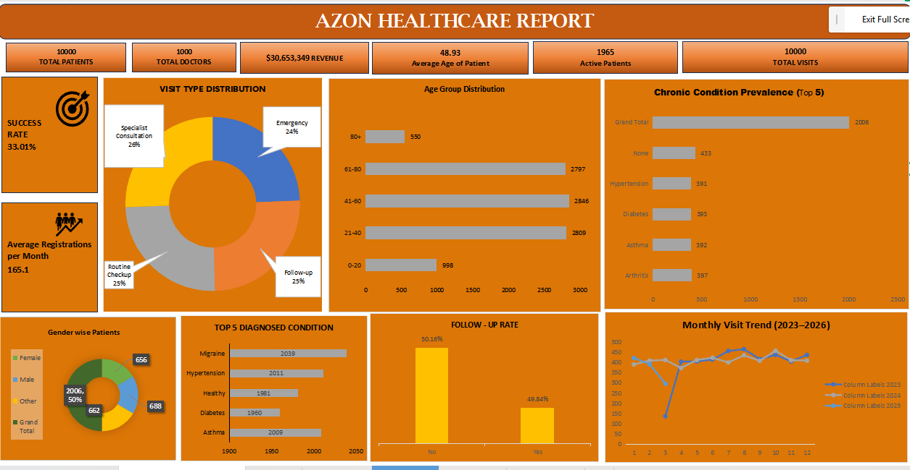

# Healthcare_Analytics_Dashboard
# Azon Healthcare Operational Analytics Dashboard

## 📌 Project Overview
This data analytics project was completed as part of my formal training coursework. The objective of this analysis was to process healthcare operational data from the "Azon Healthcare" database to evaluate hospital efficiency, patient demographics, and clinical performance trends. By constructing an interactive monitoring panel, this project transforms operational parameters into insights to optimize patient care and hospital revenue tracking.

## 📊 Dashboard Visualizations
### Executive Healthcare Operations Dashboard

## 🛠️ Technical Stack & Skills Developed
* **Interactive Dashboard Design:** Applied advanced business intelligence concepts to create an executive tracking interface. Formatted high-level operational KPI cards, donut charts, horizontal bar graphs, and line trends.
* **Demographic Analytics:** Maintained patient volume metrics across multi-layered distributions, charting patient populations by specific age groups (0-20 up to 80+) and gender classifications.
* **Clinical Pipeline Monitoring:** Structured analytical reporting layers to categorize clinical parameters, tracking specific indicators like patient visit types (Emergency, Follow-up, Routine) and chronic condition volumes.

## 💡 Core Metrics & Data Insights
* **Operational Scale:** Successfully monitored hospital database parameters tracking **10,000 total patients**, **1,000 total doctors**, and **10,000 total patient visits**.
* **Financial Performance:** Evaluated clinical billing data parameters to track a total accumulated **Revenue of $30,653,349** alongside a **Monitored Success Rate of 33.01%**.
* **Clinical Diagnosis Distributions:** Analyzed diagnostic trends across the patient database, isolating **Migraine (2,039 records)** and **Hypertension (2,011 records)** as the top leading diagnosed chronic conditions affecting the tracked population.
